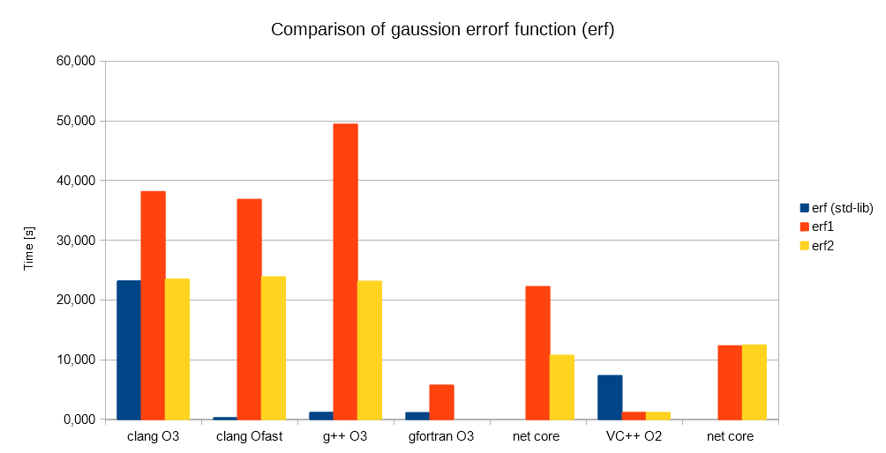

# erf (Error function) Problem on Linux

Problem with [erf](http://mathworld.wolfram.com/Erf.html) on Linux

It is strange that the variant [erf1](c++/special_functions.cpp) is a lot of slower than [erf2](c++/special_functions.cpp).

It is strange all the way -- even (or especially :wink:) on Windows. Here the C++ standardlib implementation is slowest. On Linux this is the fastest.

On Windows _erf1_ and _erf2_ are similar, performance wise. 
On Linux _erf1_ is a disaster. I don't know why.

[erf1](fortran/erf_test.f95) compiled with Fortran (gfortran) yields super speeds.

# Update

I did some benchmarks...see table for results. Details are in [results](results/results.xlsx)

|               | linux-x64 |   linux-x64 | linux-x64 |   linux-x64 | linux-x64 | win-x64 |  win-x64 |
|:-------------:|----------:|------------:|----------:|------------:|----------:|--------:|---------:|
|               |  clang O3 | clang Ofast |    g++ O3 | gfortran O3 |  net core | VC++ O2 | net core |
| erf (std-lib) |    23.227 |       0.329 |     1.219 |       1.164 |         - |   7.369 |        - |
|      erf1     |    38.176 |      36.873 |    49.462 |       5.776 |    22.272 |   1.203 |   12.352 |
|      erf2     |    23.519 |      23.895 |    23.165 |           - |    10.779 |   1.201 |   12.498 |

